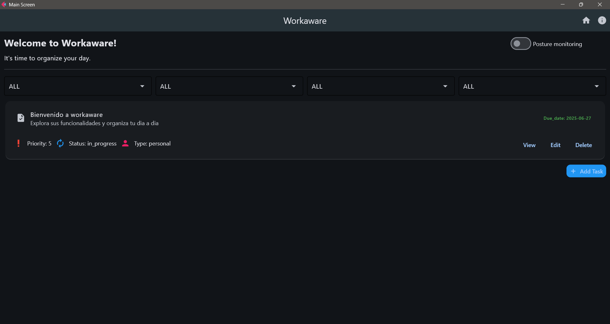

# Workaware v1.0.0

## 1. Descripción General

**Workaware** es una aplicación de escritorio multiplataforma desarrollada en Python con Flet, orientada a la gestión de tareas y el monitoreo de postura. Incorpora notificaciones, alertas sonoras, interfaz moderna y responsive, y persistencia de datos con SQLite y SQLAlchemy.



---

## 2. Arquitectura y Estructura del Proyecto

```
workaware/
│
├── app/
│   ├── db_actions.py
│   ├── notifier.py
│   ├── posture_monitor.py
│   ├── session_logger.py
│   └── ...
│
├── detector/
│   └── detector.py
│
├── Interface/
│   ├── main_screen.py
│   ├── add_update_screen.py
│   ├── expand_task_screen.py
│   └── ...
│
├── models/
│   └── task.py
│
├── assets/
│   └── icon.png
│
├── sounds/
│   └── ...
│
├── database.py
├── devices.db
├── main.py
├── README.md
├── LICENSE
├── requirements.txt / pyproject.toml
└── ...
```

---

## 3. Principales Capacidades

### 3.1 Gestión de Tareas

- Crear, editar, eliminar y visualizar tareas.
- Campos: título, descripción, prioridad, estado, tipo, fecha de vencimiento, duración estimada.
- Filtros avanzados por prioridad, estado y tipo.

### 3.2 Monitoreo de Postura

- Usa la cámara y MediaPipe para detectar postura.
- Notificaciones visuales y sonoras si se detecta mala postura.
- Switch para activar/desactivar el monitoreo.
- Registro de tiempo en buena/mala postura.

### 3.3 Notificaciones y Alertas

- Notificaciones de escritorio usando Plyer.
- Alertas sonoras usando Pygame.
- Control de frecuencia y supresión de notificaciones duplicadas.

### 3.4 Interfaz de Usuario

- Basada en Flet, con diseño responsive.
- Pantalla de carga (splash screen) con logo y nombre.
- Iconos y tarjetas para mejor experiencia visual.
- Navegación entre pantallas usando rutas.

### 3.5 Persistencia y Base de Datos

- SQLite gestionado con SQLAlchemy.
- Migración automática de tablas si no existen.

### 3.6 Autoría y Créditos

- Encabezados en todos los archivos fuente.
- Sección de créditos en la interfaz y documentación.
- Archivo LICENSE y README con datos del autor.

---

## 4. Principales Archivos y Módulos

- **main.py**: Punto de entrada, splash screen, navegación y rutas.
- **db_actions.py**: Acciones CRUD sobre la base de datos.
- **posture_monitor.py**: Lógica de monitoreo de postura y control de hilos.
- **notifier.py**: Notificaciones y alertas sonoras.
- **main_screen.py**: Pantalla principal, filtros y switch de monitoreo.
- **add_update_screen.py**: Pantalla para añadir/editar tareas.
- **expand_task_screen.py**: Vista expandida de detalles de tarea.
- **task.py**: Modelo de datos de la tarea.
- **detector.py**: Lógica de detección de postura con MediaPipe/OpenCV.
- **assets/**: Iconos e imágenes.
- **sounds/**: Archivos de sonido para alertas.
- **database.py**: Configuración de SQLAlchemy y conexión a SQLite.

---

## 5. Dependencias Principales

- **Python >= 3.12**
- **Flet >= 0.28.3**
- **SQLAlchemy >= 2.0.41**
- **Plyer >= 2.1.0**
- **Pygame >= 2.6.1**
- **Mediapipe >= 0.10.21**
- **OpenCV-Python >= 4.11.0.86**
- **certifi >= 2025.4.26**

---

## 6. Ejecución y Uso

### 6.1 Ejecución en modo desarrollo

```bash
python main.py
```

### 6.2 Empaquetado como ejecutable

Usa PyInstaller o Flet Build, asegurando incluir iconos y recursos.

---

## 7. Seguridad y Autoría

- Todos los archivos fuente incluyen encabezados con nombre, año y derechos.
- Archivo LICENSE con licencia MIT y nombre del autor.
- README y pyproject.toml con datos de autoría.
- Icono y nombre personalizados en la app y ejecutable.
- Repositorio público en GitHub como evidencia de autoría.

---

## 8. Consideraciones Técnicas

- El icono de la ventana solo puede personalizarse en el ejecutable, no en modo desarrollo.
- Las notificaciones dependen del sistema operativo y pueden variar en comportamiento.
- El monitoreo de postura usa hilos y debe sincronizarse correctamente al navegar entre pantallas.
- El splash screen se muestra solo al inicio, antes de la pantalla principal.

---

## 9. Créditos

Desarrollado por **Juan David Rivaldo Diaz Sierra**
📧 [juandavidrivaldo1@gmail.com](mailto:juandavidrivaldo1@gmail.com)
🔗 [LinkedIn](https://www.linkedin.com/in/juan-david-rivaldo-diaz-sierra-72aa99222)

---

¿Quieres que agregue ejemplos de código, diagramas de flujo, o instrucciones de despliegue específicas?
